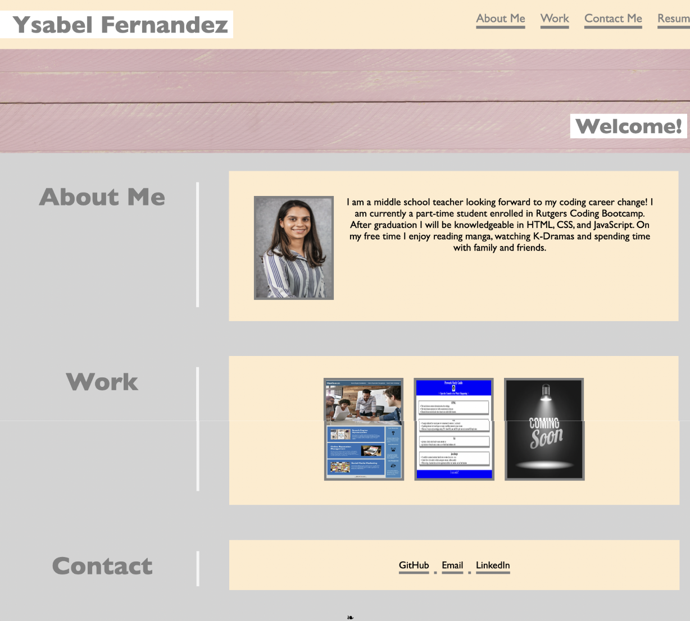

# Professional Portfolio

## Description
As a coder I showcased my skills and talents to potential employers.  I have included my strongerst work as well as the thought process behind it.  I have included the core skills I learned so far: flexbox, media queries and CSS variables. 

## Visuals

## Link
https://ysafernandez.github.io/professional-portfolio/

## Usage
To navigate please click on the top right information you are interested in and it will take you to the section for more details. 

## Credits
Credits to: https://depositphotos.com & https://www.freepik.com/ 

## License
Please refer to the LICENSE in the repo.
